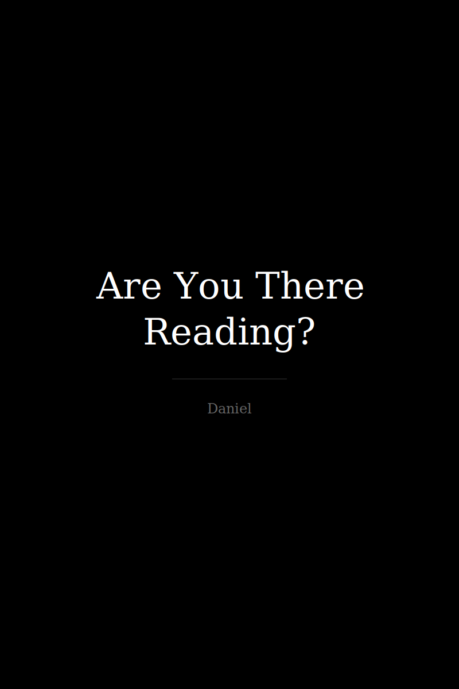

<p align="center">
  
</p>

<h1 align="center">Are You There Reading?</h1>

<p align="center">
  <em>An exploration of chance, destiny, and the invisible threads that weave our existence</em>
</p>

<p align="center">
  <a href="#about">About</a> •
  <a href="#chapters">Chapters</a> •
  <a href="#read-online">Read Online</a> •
  <a href="#author">Author</a>
</p>

<p align="center">
  
  
  
  
</p>

---

## About

> *"Chance or destiny? Perhaps the question is more important than the answer."*

What if every accident was meant to happen? What if the book you're reading right now was waiting for you?

This book weaves **chaos theory**, **neuroscience**, and **philosophy** into a 12-chapter journey exploring the invisible forces that shape our lives. From the butterfly effect to synchronicity, from peer pressure to the edges of reality—this is a meditation on whether we write our story or simply read it.

**This is not self-help. This is not a scientific study. This is about what it feels like to be human.**

---

## Chapters

<table>
<tr>
<td align="center" width="50">I</td>
<td><a href="chapters/01-threshold-of-existence.md"><strong>The Threshold of Existence</strong></a><br/><sub>Where chance meets destiny at the door of consciousness</sub></td>
</tr>
<tr>
<td align="center">II</td>
<td><a href="chapters/02-chance-and-destiny.md"><strong>Chance and Destiny</strong></a><br/><sub>Between the illusion of control and the invisible fabric</sub></td>
</tr>
<tr>
<td align="center">III</td>
<td><a href="chapters/03-butterfly-effect.md"><strong>The Unexpected Accident</strong></a><br/><sub>The butterfly effect in real life</sub></td>
</tr>
<tr>
<td align="center">IV</td>
<td><a href="chapters/04-synchronicity.md"><strong>Synchronicity</strong></a><br/><sub>When the universe whispers your name</sub></td>
</tr>
<tr>
<td align="center">V</td>
<td><a href="chapters/05-eternal-present.md"><strong>The Eternal Present</strong></a><br/><sub>The only reality that exists</sub></td>
</tr>
<tr>
<td align="center">VI</td>
<td><a href="chapters/06-peer-pressure.md"><strong>Peer Pressure</strong></a><br/><sub>The mirage of individuality</sub></td>
</tr>
<tr>
<td align="center">VII</td>
<td><a href="chapters/07-chance-in-science.md"><strong>Chance in Science</strong></a><br/><sub>Discoveries that shouldn't have happened</sub></td>
</tr>
<tr>
<td align="center">VIII</td>
<td><a href="chapters/08-are-we-programmed.md"><strong>Are We Programmed?</strong></a><br/><sub>Free will vs. biological and cultural code</sub></td>
</tr>
<tr>
<td align="center">IX</td>
<td><a href="chapters/09-destiny-and-mind.md"><strong>Destiny and the Human Mind</strong></a><br/><sub>How our brain creates meaning from chaos</sub></td>
</tr>
<tr>
<td align="center">X</td>
<td><a href="chapters/10-edges-of-reality.md"><strong>The Edges of Reality</strong></a><br/><sub>Where perception meets the unknown</sub></td>
</tr>
<tr>
<td align="center">XI</td>
<td><a href="chapters/11-you-and-i.md"><strong>This Book, You and I</strong></a><br/><sub>The invisible dialogue between author and reader</sub></td>
</tr>
<tr>
<td align="center">XII</td>
<td><a href="chapters/12-final-message.md"><strong>A Message for You</strong></a><br/><sub>The last coincidence</sub></td>
</tr>
</table>

---

## Read Online

You can read the entire book in two ways:

| Format | Description |
|--------|-------------|
| [**Chapter by Chapter**](chapters/) | Navigate through individual chapters |
| [**Full Book**](FULL_BOOK.md) | Read everything in one page |

---

## Chapter Connections

```
                    ┌─────────────────────────────────────┐
                    │      ARE YOU THERE READING?         │
                    │      Map of Chapter Connections     │
                    └─────────────────────────────────────┘

     ┌──────────────┐                      ┌──────────────┐
     │  Ch 1        │─────────────────────►│  Ch 3        │
     │  Threshold   │                      │  Butterfly   │
     └──────┬───────┘                      └──────┬───────┘
            │                                     │
            ▼                                     ▼
     ┌──────────────┐                      ┌──────────────┐
     │  Ch 2        │◄────────────────────►│  Ch 5        │
     │  Chaos       │                      │  AI & Time   │
     └──────┬───────┘                      └──────┬───────┘
            │                                     │
            ▼                                     ▼
     ┌──────────────┐                      ┌──────────────┐
     │  Ch 4        │─────────────────────►│  Ch 7        │
     │  Synchrony   │                      │  Science     │
     └──────┬───────┘                      └──────┬───────┘
            │                                     │
            ▼                                     ▼
     ┌──────────────┐                      ┌──────────────┐
     │  Ch 6        │◄────────────────────►│  Ch 8        │
     │  Pressure    │                      │  Programmed  │
     └──────┬───────┘                      └──────┬───────┘
            │                                     │
            ▼                                     ▼
     ┌──────────────┐                      ┌──────────────┐
     │  Ch 9        │─────────────────────►│  Ch 10       │
     │  Mind        │                      │  Reality     │
     └──────┬───────┘                      └──────┬───────┘
            │                                     │
            └─────────────┬───────────────────────┘
                          ▼
                   ┌──────────────┐
                   │  Ch 11       │
                   │  You and I   │
                   └──────┬───────┘
                          │
                          ▼
                   ┌──────────────┐
                   │  Ch 12       │
                   │  Message     │
                   └──────────────┘
```

---

## Key Themes

<table>
<tr>
<td align="center" width="33%">
<h3>Science</h3>
<sub>Chaos Theory • Butterfly Effect<br/>Neuroscience • Quantum Physics<br/>Artificial Intelligence</sub>
</td>
<td align="center" width="33%">
<h3>Philosophy</h3>
<sub>Free Will • Determinism<br/>Synchronicity • Buddhism<br/>Eternalism</sub>
</td>
<td align="center" width="33%">
<h3>Psychology</h3>
<sub>Peer Pressure • Conformity<br/>Hindsight Bias • Perception<br/>Pattern Recognition</sub>
</td>
</tr>
</table>

---

## Historical Cases Explored

- **Franz Ferdinand's assassination** — The coincidence that started WWI
- **Frane Selak** — The man who survived everything
- **Trump assassination attempts** — Chance in modern politics
- **Baltimore Bridge collapse** — Minutes that saved lives
- **Scientific discoveries** — Penicillin, X-rays, LSD, Velcro, Microwave

---

## Author

<table>
<tr>
<td width="120" align="center">

<br/>
<strong>Daniel</strong>
</td>
<td>
<p>Independent AI researcher based in Spain. Creator of <a href="https://github.com/gamogestionweb/Orion">Orion</a>, a personal AI application with 207+ iterations.</p>
<p>Coined the concept of <strong>Individual Artificial Personality (IAP)</strong> — the idea that the future of AI is millions of deeply personal intelligences, not one monolithic system.</p>
<p>
<a href="mailto:gamogestionweb@gmail.com">Email</a> •
<a href="https://www.tiktok.com/@sucesoshoy">TikTok</a> •
<a href="https://github.com/gamogestionweb">GitHub</a>
</p>
</td>
</tr>
</table>

---

## License

<p align="center">
<a href="https://creativecommons.org/licenses/by/4.0/">

</a>
</p>

This work is licensed under [Creative Commons Attribution 4.0 International](https://creativecommons.org/licenses/by/4.0/).

---

## Connections

<table>
<tr>
<td width="50%">

### The companion book

> *"El mejor final siempre acaba mal."*

**[100 Días de una Vida](https://github.com/gamogestionweb/100-dias-de-una-vida)** is the poetic companion to this book. While "Are You There Reading?" asks if we control our destiny, "100 Días" shows a character named Abel choosing to live despite everything.

Philosophy and poetry. Theory and experience.

</td>
<td width="50%">

### The AI experiment

What if we could test free will in AI agents?

**[Genesis Simulation](https://github.com/gamogestionweb/genesis-simulation)** places AI agents in paradise with one prohibition. They chose to disobey. Was it free will or were they programmed to fall?

</td>
</tr>
<tr>
<td>

### The physics of destiny

If the present contains all information of past and future, is destiny real?

**[PCP Universe](https://github.com/gamogestionweb/pcp-universe)** tests this on real IBM quantum computers. The preliminary results suggest information is never destroyed—only redistributed.

</td>
<td>

### AI discovering truth

**[Physics Discovery AI](https://github.com/gamogestionweb/physics-discovery-ai)** lets AI discover the laws of physics through experimentation. The laws already existed. Discovering them was inevitable.

Just like reading this book. Was it chance? Or were you always going to find it?

</td>
</tr>
<tr>
<td colspan="2" align="center">

### The personal AI

**[Orion](https://play.google.com/store/apps/details?id=com.orion.proyectoorion)** — An AI that belongs to you. Legacy Mode lets you hear voices of those you've lost.

The author who wrote about connection between strangers now builds technology to maintain connection across death.

</td>
</tr>
</table>

---

<p align="center">
<em>"You are here reading. Chance? Destiny? Perhaps the answer was always here."</em>
</p>
